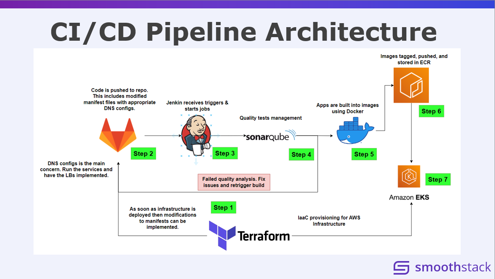

# 🚀 Aline Financial Banking Application Deployment

### _Microservices-Based Cloud Deployment with DevOps Automation_

---

📄 **Project Source:** [Client Demo Presentation](Client_Demo.pptx)

---

## 📌 Overview

This project demonstrates the **end-to-end deployment of a scalable banking application** using modern DevOps practices and cloud-native technologies.

The application, **Aline Financial**, is built on a **microservices architecture** and deployed to **Amazon Web Services (AWS)** with full automation using Infrastructure as Code (IaC) and CI/CD pipelines.

It simulates real-world banking operations such as:

- User registration
- Applicant & application management
- Bank & branch management
- Account creation and management
- Financial transactions

---

## 🧩 Architecture Summary

### 🔹 Application Components

- **5 Microservices**
- **1 API Gateway**
- **3 Frontend Portals**
- **1 MySQL Database**

---

## 🛠️ Technologies Used

### 💻 Backend

- Python
- Java
- Apache

### 🎨 Frontend

- React
- Angular
- JavaScript
- HTML / CSS / Bootstrap

### 🗄️ Database

- MySQL
- AWS RDS

### ⚙️ DevOps & Cloud

- Docker
- Kubernetes (Minikube, AWS EKS, AWS ECS)
- Terraform (Infrastructure as Code)
- Jenkins (CI/CD Automation)
- SonarQube (Code Quality Analysis)
- AWS (EC2, ECR, RDS, EKS, ECS)

### 🧰 Tools

- Git / GitLab
- Postman / Swagger
- AWS CLI

### 🤝 Collaboration

- Jira
- Confluence
- Microsoft Teams

---

## ☁️ Cloud & Deployment Architecture

This project implements a **fully automated cloud deployment pipeline**:

- Containerized services using **Docker**
- Orchestrated deployments with **Kubernetes (EKS)**
- Infrastructure provisioned via **Terraform**
- CI/CD pipeline using **Jenkins**
- Image storage using **Amazon ECR**
- Managed database using **AWS RDS**

---

## 🔄 CI/CD Pipeline

The pipeline automates:

```text
Code Commit → Build → Test → Code Analysis → Docker Build → Push to ECR → Deploy to EKS
```

### Key Features:

- Automated builds and deployments
- Code quality checks via SonarQube
- Continuous delivery to AWS EKS
- Scalable and repeatable deployments

---

## 📊 Key Features Implemented

✔️ Microservices architecture
✔️ Containerized application deployment
✔️ Kubernetes orchestration
✔️ Infrastructure as Code (Terraform)
✔️ Automated CI/CD pipeline
✔️ Cloud-native AWS deployment
✔️ Data generation for testing using Python

---

## 👨‍💻 My Contributions (Jorge Luis Canales Jr.)

### 🔹 Responsibilities

- Deployed application to **Amazon EKS** using Jenkins
- Built and pushed Docker images to **Amazon ECR**
- Configured CI/CD pipelines for automation
- Integrated **SonarQube** for code quality analysis
- Installed and configured required dependencies and tools

### 🔹 Implementation Work

- Pulled and tested application locally
- Generated test data using Python
- Containerized services using Docker
- Tested deployments using Minikube
- Automated infrastructure with Terraform
- Deployed scalable workloads to AWS EKS
- Integrated Agile tools (Jira, Confluence, Teams)

---

## 🧠 What This Project Demonstrates

This project highlights real-world DevOps and cloud engineering skills:

- Designing scalable distributed systems
- Automating infrastructure and deployments
- Working with Kubernetes in production-like environments
- Implementing CI/CD pipelines from scratch
- Collaborating in Agile team environments

---

## 📷 Architecture Diagrams

- Microservices Architecture
- Cloud Architecture
- CI/CD Pipeline
- Database Schema

---



---

## 🚀 Getting Started (Optional Section)

```bash
# Clone repository
git clone https://github.com/yourusername/your-repo.git

# Navigate into project
cd your-repo

# Example: Build Docker image
docker build -t your-image .

# Deploy with Kubernetes
kubectl apply -f deployment.yaml
```

---

## 📈 Future Improvements

- Enhance monitoring (Prometheus / Grafana)
- Improve security (IAM roles, secrets management)
- Add auto-scaling policies
- Expand test coverage

---

## 🙌 Acknowledgments

This project was developed collaboratively by:

- Joe Putz
- Jorge Luis Canales Jr.
- Mehedi Waheed Meem

---

## 📬 Contact

If you'd like to connect or discuss this project:

**Jorge Luis Canales Jr.**
DevOps Engineer | Aspiring Data Specialist

---

### ⭐ If you found this project helpful, consider giving it a star!

---
